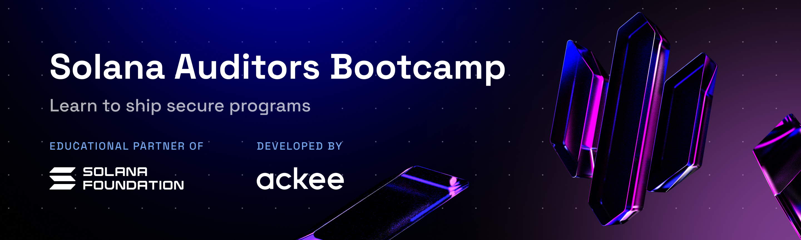

# Solana Auditors Bootcamp

Learn to audit Solana programs and help secure the ecosystem. Take your security practices to the next level and get certified by Ackee Blockchain Security. It's free, too.

Solana Auditors Bootcamp 2024:
- 100% free
- 7 weeks, online & in English
- Starting on Aug 14
- Supported by Solana Foundation


# What can I expect during the course?

|Week #|Lecture|Task|
|--|--|--|
|Week 1|[**Advanced Anchor**](./Lesson-1/README.md)|-|
|Week 2|[**Integration Tests and Unit Tests**](./Lesson-2/README.md)|-|
|Week 3|[**Fuzzing with Trident I**](./Lesson-3/README.md)|[**Fuzzing with Trident**](https://github.com/Ackee-Blockchain/trident)|
|Week 4|[**Fuzzing with Trident II**](./Lesson-4/README.md)|-|
|Week 5|[**Security Best Practices**](./Lesson-5/README.md)|- |
|Week 6|[**Common Vulnerability Vectors**](./Lesson-6/README.md)|[**Capture the Flag**](./Capture-the-Flag/README.md) Challenge|
|Week 7|**Graduation Ceremony**|-|
</div>

-----

# What to prepare?

> [!important]
> We also prepared Docker Image with all required dependencies already installled, for both [x86](#docker-image-x86) and [ARM](#docker-image-arm) architectures to use for Trident.


## Manual Setup

[WSL]: https://learn.microsoft.com/en-us/windows/wsl/install
[Solana]: https://docs.solanalabs.com/cli/install
[Anchor]: https://www.anchor-lang.com/docs/installation
[Honggfuzz]: https://github.com/rust-fuzz/honggfuzz-rs#how-to-use-this-crate

| Setup                                      | Description                     | Version               | How to Install                |
| -------------------------------------------| --------------------------------| ----------------------| ------------------------------|
| Windows subsystem for Linux(WSL)           | optional but highly recommended | 2.0                   | [Instructions][WSL]           |
| Solana tool suite                          | -                               | 1.18.18               | [Instructions][Solana]        |
| Anchor framework                           | -                               | 0.30.1                | [Instructions][Anchor]        |
| Honggfuzz                                  | -                               | 0.5.56                | [Instructions][Honggfuzz]     |


> [!NOTE]
> For step by step guide follow [Manual Setup](./Manual-Setup/README.md)


## Docker Image x86

> [!TIP]
> **Install Docker**
> You can check this guide [Install Docker Engine](https://docs.docker.com/engine/install/)


> [!IMPORTANT]
> To use the pre-built Docker image for this course, you can pull the image from Docker Hub:
> ```bash
> docker pull ackeexyz/solana-auditors-bootcamp:v1
> ```
> Then run the following command. This will create new container.
> ```bash
> docker run -it --name solana-auditors-bootcamp -p 8899:8899 -p 9900:9900 -p 8000:8000 -p 8080:8080 ackeexyz/solana-auditors-bootcamp:v1
> ```
> Then visit the following url
>
>   http://localhost:8080/
>
> When you want to continue work inside the Docker Image, use
> ```bash
> docker start solana-auditors-bootcamp
> ```
> and again visit the URL.
> To stop the Image, use
> ```bash
> docker stop solana-auditors-bootcamp
> ```
> It is also possible to start/stop the Imagre from the Docker Desktop GUI.

## Docker Image ARM

> [!TIP]
> **Install Docker**
> You can check this guide [Install Docker Engine](https://docs.docker.com/engine/install/)


> [!IMPORTANT]
> To use the pre-built Docker image for this course, you can pull the image from Docker Hub:
> ```bash
> docker pull ackeexyz/solana-auditors-bootcamp-arm:latest
> ```
> Then run the following command. This will create new container.
> ```bash
> docker run -it --name solana-auditors-bootcamp-arm -p 8899:8899 -p 9900:9900 -p 8000:8000 -p 8080:8080 ackeexyz/solana-auditors-bootcamp-arm:latest
> ```
> Then visit the following url
>
>   http://localhost:8080/
>
> When you want to continue work inside the Docker Image, use
> ```bash
> docker start solana-auditors-bootcamp-arm
> ```
> and again visit the URL.
> To stop the Image, use
> ```bash
> docker stop solana-auditors-bootcamp-arm
> ```
> It is also possible to start/stop the Imagre from the Docker Desktop GUI.

-----

# How to participate?

- You can **participate** by sending an application: [Solana Auditors Bootcamp](https://ackee.xyz/solana-auditors-bootcamp)

-----

# How to get certified?

You can obtain an Ackee Blockchain NFT certificate as a validation of your acquired skills if you fulfill the following:
‍
1) Fuzz a Solana program (details shared in week 3)
2) Pass certain levels of our capture the flag challenge (details shared in week 5)

-----

# Join Discord

Join our Discord which we will use as the main communication channel.

<p align="left">
    <a href="https://discord.gg/z3JVuZyFnp">
        
    </a>
</p>
